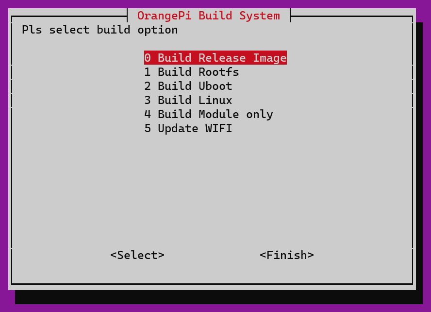

# OrangePi 3G-IOT-A Linux firmware

This are instructions to install linux Ubuntu Xenial server (16.04) on OrangePi 3G-IOT-A devices using Windows Sybsystem Linux on Windows.

## Enable WSL and Ubuntu 16.04 on Windows 10

**References:** 
- https://docs.microsoft.com/en-us/windows/wsl/install-win10
- https://docs.microsoft.com/en-us/windows/wsl/install-manual
- https://docs.microsoft.com/en-us/windows/wsl/user-support
- https://docs.microsoft.com/en-us/windows/wsl/wsl-config

### Install and setup

Open Powershell in Administrator mode and enable WSL (Needs a computer restart):

```Powershell
Enable-WindowsOptionalFeature -Online -FeatureName Microsoft-Windows-Subsystem-Linux
```


Download Ubutnu 16.04 (16.04 has been patched for over a year):

```Powershell
Invoke-WebRequest -Uri https://aka.ms/wsl-ubuntu-1604 -OutFile Ubuntu.appx -UseBasicParsing
```

Open Powershell in Administrator mode and install the downloaded package:

```Powershell
Add-AppxPackage .\Ubuntu.appx
```

Now type the following in on the terminal:

```Powershell
ubuntu

# Installing, this may take a few minutes...
```

#### Setup your default user

The first user account you create is automatically (https://aka.ms/wslusers) configured with a few special attributes:
- It is your default user -- it signs-in automatically on launch.
- It is Linux administrator (a member of the sudo group) by default.
Type in a Linux username and password for the user. 

**NOTE:** You will need this password to perform `sudo` commands (dont loose it):

```Bash
# Installation successful!
# Please create a default UNIX user account. The username does not need to match your Windows username.
# For more information visit: https://aka.ms/wslusers
# Enter new UNIX username:

orangepi

# Enter new UNIX password:
orangepi

# Retype new UNIX password:
orangepi

# passwd: password updated successfully
# Default UNIX user set to: orangepi
# To run a command as administrator (user "root"), use "sudo <command>".
# See "man sudo_root" for details.
```

You are now in an ubuntu session:

```
orangepi@windows:~$
```

Having to enter a password when executing sudo commands is a pain so lets remove that.
**Note** that this is based on the default user being named `orangepi`. 

```Bash
sudo su

# [sudo] password for orangepi:

cat<<EOF > /etc/sudoers.d/orangepi && chmod 0440 /etc/sudoers.d/orangepi
orangepi ALL=(ALL) NOPASSWD:ALL
EOF
```


### Managing distro

You can manage the Ubuntu instance from a Powershell session:

```Powershell
ubuntu.exe /?

# Launches or configures a linux distribution.
# 
# Usage:
#     <no args>
#       - Launches the distro's default behavior. By default, this launches your default shell.
# 
#     run <command line>
#       - Run the given command line in that distro, using the default configuration.
#       - Everything after `run ` is passed to the linux LaunchProcess call.
# 
#     config [setting [value]]
#       - Configure certain settings for this distro.
#       - Settings are any of the following (by default)
#         - `--default-user <username>`: Set the default user for this distro to <username>
# 
#     clean
#       - Uninstalls the distro. The appx remains on your machine. This can be
#         useful for "factory resetting" your instance. This removes the linux
#         filesystem from the disk, but not the app from your PC, so you don't
#         need to redownload the entire tar.gz again.
# 
#     help
#       - Print this usage message.
```

You can also enter an ubuntu shell from other terminal emulators like `Powershell` or `cmd` by typing `ubuntu`:

```Powershell
ubuntu

# root@windows10:~#
```

You can also change the default user if you want to change it from your previously created one:

```Powershell
ubuntu config --default-user orangepi
```

## Making Enviroment for OrangePi 3G-IOT-A

```Bash
orangepi@Rafa-Win10:~$ cd
orangepi@Rafa-Win10:~$ mkdir OrangePi3G-iot
orangepi@Rafa-Win10:~$ cd OrangePi3G-iot/
orangepi@Rafa-Win10:~/OrangePi3G-iot$
```

Now clone the repositories:
```Bash
git clone https://github.com/RafaelReyesCarmona/OrangePi3G-iot_scripts.git
git clone https://github.com/RafaelReyesCarmona/OrangePi3G-iot_kernel.git
git clone https://github.com/RafaelReyesCarmona/OrangePi3G-iot_external.git
git clone https://github.com/RafaelReyesCarmona/OrangePi3G-iot_bootloader.git
git clone https://github.com/RafaelReyesCarmona/OrangePi3G-iot_toolchain.git
git clone https://github.com/RafaelReyesCarmona/OrangePi3G-iot_updates.git
```

Create symbolic links:
```Bash
ln -s OrangePi3G-iot_bootloader/ uboot
ln -s OrangePi3G-iot_external/ external
ln -s OrangePi3G-iot_kernel/ kernel
ln -s OrangePi3G-iot_scripts/ scripts
ln -s OrangePi3G-iot_toolchain/ toolchain
ln -s OrangePi3G-iot_updates/ updates
ln -s OrangePi3G-iot_scripts/build.sh build.sh
```

Run './build.sh', root password is required.

```Bash
orangepi@Rafa-Win10:~/OrangePi3G-iot$ ./build.sh

 This script requires root privileges, trying to use sudo

[sudo] password for orangepi:
``` 

Script will install all necesary from apt and chows 'Orange Pi Build System' menu. Select platform 'OrangePi 3g-iot-A' or 'OrangePi 3g-iot-B'.


Next step select opction you will do:
 0 Build Release Image
 1 Build Rootfs
 2 Build Uboot
 3 Build Linux
 4 Build Module only
 5 Update WIFI

 

 Select 'Build Release Image' and Ubuntu server. At the end of the process you get a file and directory with all files to burn the device placed on 'output/images'.

 ```
+ cd /home/orangepi/OrangePi3G-iot/output/images
+ tar -cvzf OrangePi_3g-iot-A_ubuntu_xenial_server_linux3.4.67_v1.1.tar.gz OrangePi_3g-iot-A_ubuntu_xenial_server_linux3.4.67_v1.1
OrangePi_3g-iot-A_ubuntu_xenial_server_linux3.4.67_v1.1/
OrangePi_3g-iot-A_ubuntu_xenial_server_linux3.4.67_v1.1/boot_sd.img
OrangePi_3g-iot-A_ubuntu_xenial_server_linux3.4.67_v1.1/boot.img
OrangePi_3g-iot-A_ubuntu_xenial_server_linux3.4.67_v1.1/preloader_hexing72_cwet_lca.bin
OrangePi_3g-iot-A_ubuntu_xenial_server_linux3.4.67_v1.1/logo.bin
OrangePi_3g-iot-A_ubuntu_xenial_server_linux3.4.67_v1.1/rootfs.img
OrangePi_3g-iot-A_ubuntu_xenial_server_linux3.4.67_v1.1/lk.bin
OrangePi_3g-iot-A_ubuntu_xenial_server_linux3.4.67_v1.1/MT6572_Android_scatter.txt
OrangePi_3g-iot-A_ubuntu_xenial_server_linux3.4.67_v1.1/boot_nand.img
```

Added new menu option to change wifi info (SSID and PASSWORD) fastly.


## Burn firmware to OrangePi3G-IOT-A

Now you can use Smart Phone Flash Tool on the download page of Orange Pi 3G-IoT section.


Options:
* Download-Agent: choose MTK_AllInOne_DA.bin.


* Scatter-loading File: choose MT6572_Android_scatter.txt


Procedure:
* Run flash_util.exe 
* Configure options above.
* Place jumpers as this: 
* Click 'Download' buttom. 
* Plug usb cable from OrangePi3G-IOT-A's microusb to computer usb port.
* Download firmware will finish when 'ok' splash shows. 

 Only the lk and kernel were burned in the front. Since OrangePi3G-iot-A only has 512M on-board storage, there is a problem of insufficient space, so you need to burn the rootfs to a TF card, and prepare a TF
card with more than 8G and class10. After formatting, burn roofs.img into it.

### Burn .img to SD 
#### Linux
To flash img to sd card run the follow command:
```Bash
pv rootfs.img | sudo dd of=/dev/sdb bs=1M
```

sdb is the device file corresponding to the TF card

#### Windows
If it is a windows system, you can also use Win32DiskImager or BalenaEtcher software to burn.


If BalenaEtcher show this error click 'Continue' and Flash.
